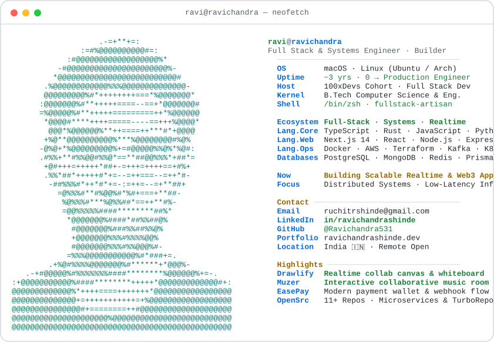
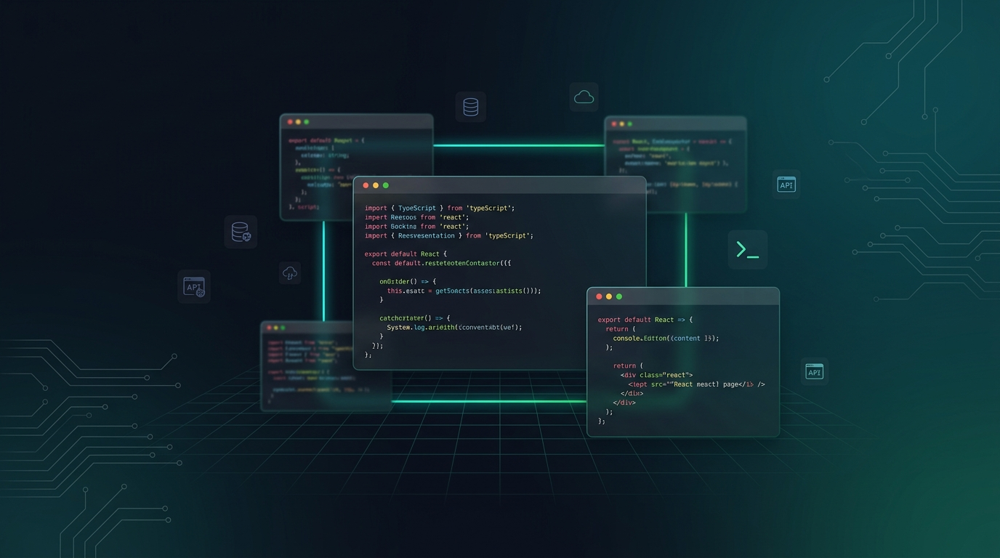

<a href="https://github.com/Ravichandra531">
  <picture>
    <source media="(prefers-color-scheme: dark)" srcset="./assets/dark_mode.svg">
    
  </picture>
</a>

---

### 🌱 Currently & About Me

- 🎓 &nbsp;**Computer Science Undergraduate** ('24 – '28) at **Rishihood University, Newton School of Technology**.
- ⚡ &nbsp;**Algorithmic Problem Solver** — **1800+ LeetCode Contest Rating** (Top ~7% globally / Contest Knight). Strong foundations in advanced Data Structures, Dynamic Programming, Graph Theory, and Concurrency.
- 🔭 &nbsp;**Full-Stack & Systems Engineer** — Designing high-throughput web applications, real-time collaboration engines (<50ms latency), and low-latency microservices.
- 🏗️ &nbsp;**Scalable Architecture & Monorepos** — Building multi-service architectures using **Turborepo**, shared **Prisma** schemas, **PostgreSQL**, **Docker**, and automated CI/CD deployment pipelines.

---

### 🛠️ Tech Stack & Toolbox

| Category | Technologies & Tools |
| :--- | :--- |
| **Languages** |      |
| **Frontend** |       |
| **Backend & Realtime** |      |
| **Databases & ORM** |    |
| **DevOps & Cloud** |      |

---

### 🚀 Featured Projects

<table>
  <tr>
    <td width="50%" valign="top">
      <h3 align="center">🎨 <a href="https://github.com/Ravichandra531/DRAWLIFY">Drawlify</a></h3>
      
<b>Real-time Collaborative Whiteboard & Canvas Platform</b>

      
Full-stack collaborative whiteboard allowing distributed teams to sketch and brainstorm simultaneously on an infinite canvas. Features a custom HTML5 Canvas engine with hand-drawn aesthetics (Rough.js), sub-50ms WebSocket shape sync, Turborepo monorepo architecture, Google OAuth + JWT auth, and containerized Docker CI/CD.

      

        
        
        
        
        
      

    </td>
    <td width="50%" valign="top">
      <h3 align="center">🎵 <a href="https://github.com/Ravichandra531/Muzer">Muzer</a></h3>
      
<b>Interactive Community Music Streaming Platform</b>

      
Real-time music streaming platform putting playlist curation in the hands of the audience. Creators host rooms with shareable Room IDs, audience submits YouTube songs and votes in real time. Dynamic voting queue automatically calculates upvotes and promotes top-voted songs to the stream head.

      

        
        
        
        
      

    </td>
  </tr>
  <tr>
    <td width="50%" valign="top">
      <h3 align="center">💼 <a href="https://github.com/Ravichandra531/HireHub">HireHub</a></h3>
      
<b>Full-Stack Developer Recruitment & Job Portal</b>

      
End-to-end recruitment platform with Role-Based Access Control (RBAC) differentiating employer and candidate workflows. Includes job postings, application status tracking, secure authentication, scalable Node.js/Express REST APIs, and Prisma ORM with PostgreSQL.

      

        
        
        
        
      

    </td>
    <td width="50%" valign="top">
      <h3 align="center">💳 <a href="https://github.com/Ravichandra531/EasePay">EasePay</a></h3>
      
<b>ACID-Compliant Digital Payments & Wallet Hub</b>

      
Production-grade digital wallet architecture featuring transactional money transfers, mock bank integration, and webhook reconciliation workflows built in a modern Turborepo monorepo with PostgreSQL & Prisma ORM.

      

        
        
        
        
      

    </td>
  </tr>
</table>

---

  

---

### 📫 Connect & Socials

&nbsp;

&nbsp;

&nbsp;

 

  <i>“Turning complex engineering challenges into elegant, high-performance distributed systems.”</i>

